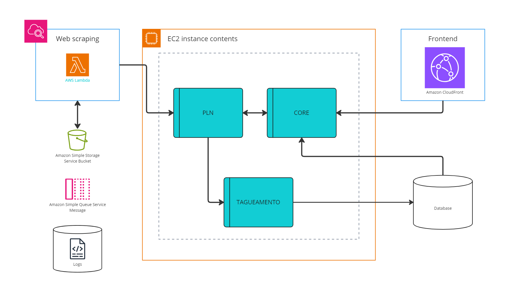

# Fomentando o Aprendizado Contínuo em Sistemas Conversacionais com MLOps

## 1. Introdução

Nos últimos anos, a adoção de agentes conversacionais (chatbots) tem crescido exponencialmente em diversas indústrias, principalmente em sistemas de suporte ao cliente e automação de tarefas. Embora soluções baseadas em Processamento de Linguagem Natural (PLN) como IBM Watson e Google DialogFlow tenham facilitado o desenvolvimento de sistemas conversacionais, o aprendizado contínuo e a escalabilidade ainda representam desafios significativos.

Sem a integração de práticas robustas de MLOps (Machine Learning Operations), as arquiteturas de sistemas conversacionais muitas vezes carecem de mecanismos automatizados para monitorar e melhorar os modelos de aprendizado ao longo do tempo. Isso pode resultar em problemas como:

- **Dificuldade em realizar melhorias contínuas nos modelos**: O processo manual de treinamento e reimplementação de modelos dificulta a adaptação a novos dados.
- **Falta de feedback contínuo**: Modelos não são constantemente monitorados para identificar falhas ou oportunidades de melhoria com base no uso real.
- **Escalabilidade limitada**: Sem um pipeline automatizado, o crescimento e a personalização do sistema conversacional para novos casos de uso ou novos domínios de aplicação tornam-se lentos e custosos.

Segundo **Wazlawick (2021)**, uma pesquisa aplicada e tecnológica precisa não apenas entregar uma solução que resolva o problema inicial, mas também ser capaz de evoluir conforme as necessidades do ambiente de operação mudam. Portanto, a implementação de uma estratégia de MLOps pode fornecer o suporte necessário para o desenvolvimento contínuo e a evolução natural desses sistemas.

### Objetivo
Este trabalho propõe uma estratégia para fomentar a atualização contínua de modelos de PLN em sistemas conversacionais, utilizando práticas de MLOps. O objetivo é garantir que o sistema evolua de maneira automática e escalável, adaptando-se constantemente a novos dados e contextos de uso. A seguir, será apresentada uma visão geral da arquitetura atual e a proposta de modificação que integra MLOps, facilitando o aprendizado contínuo e a melhoria do desempenho do sistema conversacional.

### Justificativa

Sistemas conversacionais frequentemente sofrem com a perda de eficácia devido à falta de atualizações e refinamentos contínuos. A adoção de uma estratégia MLOps visa resolver este problema, automatizando a gestão de dados, o treinamento de modelos e a integração das melhorias. A solução aqui proposta deve oferecer maior eficiência e precisão em sistemas de PLN, enquanto diminui os custos operacionais a longo prazo.

## 2. Solução Proposta

### 2.1 Arquitetura Atual

A arquitetura atual do sistema conversacional é composta por cinco componentes principais: o Web scraping, o módulo de Processamento de Linguagem Natural (PLN), o CORE, o serviço de Tagging, o Frontend e a integração com o sistema de Speech-to-Text. Esta arquitetura permite que as entradas de áudio sejam transcritas, passadas para o CORE, processadas pelo PLN, e, em seguida, os dados sejam acessados em um banco de dados para retornar as respostas ao usuário.

#### Diagrama da Arquitetura Atual

#### Descrição dos Módulos

- **Frontend**: Responsável por coletar as entradas do usuário (texto ou áudio) e exibir as respostas do agente conversacional.
  
- **Speech-to-Text**: Serviço responsável pela conversão de áudio em texto para facilitar a entrada no sistema.
- **CORE**: Módulo principal de integração e orquestração entre o Speech-to-Text, o PLN e o banco de dados.
- **PLN**: Módulo que faz o processamento de linguagem natural utilizando modelos treinados para identificar intenções e gerar respostas.
- **Serviço de Tagging**: Módulo responsável por categorizar as respostas geradas com base em intenções detectadas, facilitando o entendimento do sistema sobre o contexto da conversa.
- **Web Scraping**: Módulo que realiza a extração de dados em tempo real de fontes externas para complementar o conhecimento do sistema conversacional. 
- **API**: Intermedia as requisições entre o frontend e os serviços internos (CORE, PLN, e banco de dados).
- **Banco de Dados**: Repositório onde estão armazenadas as informações necessárias para responder as perguntas do usuário.

### 2.2 Arquitetura Proposta com MLOps

A nova arquitetura proposta para o sistema conversacional foi aprimorada com a adição de um pipeline de MLOps (chamamos de Serviço de Monitoramento na imagem da arquitetura de software), visando automatizar e otimizar o processo de atualização contínua.

Na arquitetura anterior, o sistema já contava com componentes essenciais, como um módulo de PLN, um módulo de core lógico e funcionalidades de web scraping para extração de dados. No entanto, não havia um mecanismo eficiente para coletar feedback dos usuários, ajustar os modelos de forma contínua, ou integrar de maneira automatizada novas versões de modelos treinados com base em dados de produção.

Diante disso, foram adicionados novos módulos e fluxos de dados para permitir a automação completa do ciclo de vida do aprendizado de máquina, desde a coleta de dados e feedback até o re-treinamento e implantação de novos modelos. Esses novos componentes visam aprimorar a precisão dos modelos de PLN, reduzir o tempo de resposta às mudanças no comportamento do usuário, e garantir que o sistema esteja sempre funcionando com a versão mais eficiente dos modelos.

Especificamente, a nova arquitetura inclui um pipeline de MLOps (Serviço de monitoramento) que realiza a coleta automática de feedback de interações com os usuários, armazenando esses dados para o Amazon SQS (Simple Queue Service) e realizando o re-treinamento contínuo dos modelos com novas informações coletadas por meio de web scraping e logs de desempenho. Além disso, há uma integração contínua (CI/CD) que implanta automaticamente os novos modelos validados no ambiente de produção, garantindo que o sistema seja atualizado sem interrupções e com o mínimo de intervenção manual.

#### Diagrama da Arquitetura Proposta

Esse fluxo funciona da seguinte forma:

**Serviço de Monitoramento:** Um serviço dedicado monitora constantemente as interações dos usuários com o sistema conversacional, utilizando um conceito de malha fechada. Esse serviço coleta métricas de desempenho dos modelos de PLN, como precisão, recall, tempo de resposta, e também feedback explícito ou implícito dos usuários (por exemplo, correções feitas pelo usuário em respostas fornecidas). A malha fechada refere-se ao ciclo contínuo de monitoramento e ajuste, onde os dados coletados são usados para retroalimentar o sistema, possibilitando a análise e a correção de falhas em tempo real. Isso permite que o sistema ajuste seus modelos e processos com base nas informações recebidas, garantindo uma melhoria contínua na precisão e relevância das respostas fornecidas.

**Envio para o Amazon SQS:** O serviço de monitoramento envia esses dados para uma fila no Amazon SQS. Essa fila atua como um buffer para gerenciar o fluxo de informações em tempo real, garantindo que os dados sejam armazenados de forma confiável e processados na ordem correta, sem sobrecarregar o sistema.

**Processamento e Re-treinamento:** Os dados armazenados na fila do SQS são consumidos por um serviço de processamento que, com base nesses feedbacks, inicia um pipeline de re-treinamento dos modelos de PLN. O processo pode ser configurado para ocorrer periodicamente ou ser acionado por um certo volume de feedback acumulado.

**Armazenamento em Bucket S3:** Além de ser utilizado para o re-treinamento, o feedback e os dados processados podem ser armazenados em um bucket do Amazon S3, garantindo que toda a informação coletada esteja disponível para futuras análises e auditorias.

**Implantação Contínua:** Após o re-treinamento dos modelos, um processo de integração contínua (CI/CD) pode ser acionado para implantar automaticamente as versões atualizadas dos modelos no ambiente de produção.

#### Descrição dos Módulos

- **Pipeline de MLOps**: Responsável por automatizar o monitoramento, treinamento e implantação de novos modelos de PLN. Ele coleta dados de conversas anteriores, avalia o desempenho dos modelos e, se necessário, retreina os modelos com novos dados.
  
  - **Data Ingestion**: Coleta de dados de interações do usuário para serem usados no retraining do modelo.
  - **Monitoring**: Monitoramento em tempo real da performance do modelo, identificando intenções mal compreendidas ou respostas inadequadas.
  - **Retraining Automation**: Automação do processo de treinamento dos modelos com novos dados e ajuste de hiperparâmetros.
  
- **Frontend**: Permanece o mesmo, responsável por coletar as entradas do usuário e exibir as respostas, mas agora também fornece feedback ao pipeline de MLOps.
- **Speech-to-Text**: Continua responsável pela transcrição de áudio para texto.
- **CORE**: Módulo que agora também comunica com o pipeline de MLOps para garantir que o modelo mais atualizado seja utilizado para processar as intenções.
- **PLN (com MLOps)**: O módulo de PLN agora possui uma integração direta com o pipeline de MLOps para obter atualizações contínuas de seus modelos.
- **Serviço de Tagging**: Não sofre modificações significativas, mas passa a ser monitorado quanto à eficácia de suas categorias, contribuindo para o feedback do MLOps.
- **Banco de Dados**: Agora também armazena logs e metadados que auxiliam o monitoramento do sistema MLOps.

### 2.3 Ferramentas e Frameworks 

Para implementar a arquitetura MLOps proposta e garantir um fluxo contínuo de desenvolvimento, treinamento, e implantação de modelos de aprendizado de máquina (ML), é essencial utilizar ferramentas e frameworks que suportem essas operações. Recomendo os que estão descritos a seguir:

#### **MLFlow**
O **MLFlow** é uma plataforma de código aberto que gerencia o ciclo de vida completo do machine learning. Suas principais funcionalidades são:
- **Rastreamento de Experimentos**: Armazena e rastreia parâmetros, métricas e artefatos (como modelos) durante os experimentos. Isso permite a comparação entre diferentes execuções e facilita a seleção do melhor modelo.
- **Registro de Modelos**: Gerencia diferentes versões dos modelos, possibilitando a promoção de um modelo específico para produção.
- **Serviço de Deploy**: Oferece funcionalidades para servir modelos de forma escalável e facilmente integrável com outras ferramentas.

#### **Kubeflow**
O **Kubeflow** é uma plataforma para orquestração de pipelines de machine learning, integrada ao Kubernetes para suportar escalabilidade. Ele oferece:
- **Automação de Pipelines**: Criação e gestão de pipelines de machine learning automatizados que incluem desde o pré-processamento dos dados até o deployment de modelos.
- **Escalabilidade**: Totalmente integrado com Kubernetes, possibilitando a execução de pipelines em larga escala, com fácil gerenciamento de recursos de hardware e software.
- **Facilidade de Integração**: Integrado a diversas ferramentas de ML e MLOps, facilitando a criação de soluções end-to-end.

#### **Prometheus e Grafana**
**Prometheus** e **Grafana** são ferramentas utilizadas para o monitoramento e visualização em tempo real:
- **Prometheus**: Coleta métricas de performance do pipeline de machine learning e dos modelos em produção, ajudando a identificar gargalos ou problemas de eficiência.
- **Grafana**: Usado para criar dashboards customizados que permitem visualizar, em tempo real, as métricas de modelos e pipelines. É possível criar alertas para eventos críticos, como queda de performance de um modelo.

## 3. Esforço Necessário para Implementação da Nova Arquitetura com MLOps

A implementação da nova arquitetura com MLOps para o sistema conversacional envolve um esforço significativo, tanto em termos de desenvolvimento quanto de operações contínuas. A seguir, são destacados os principais aspectos e esforços necessários para a implementação bem-sucedida:

#### 1. **Desenvolvimento e Integração de Componentes**

- **Serviço de Monitoramento**: Desenvolver um serviço que coleta métricas como precisão e tempo de resposta, além de feedback dos usuários. É necessário garantir que o serviço possa lidar com grandes volumes de dados e fornecer análises em tempo real.
  - **Custos Internos**: Salários da equipe de desenvolvimento, custos de ferramentas de análise e manutenção.
  - **Custos Externos**: Possível necessidade de consultoria especializada para otimização do serviço.

- **Integração com Amazon SQS**: Configurar o Amazon SQS para gerenciar o fluxo de dados de feedback e métricas. Isso envolve criar filas, definir políticas de retenção e garantir a correta integração com outros componentes.
  - **Custos Internos**: Tempo e recursos para configuração e integração.
  - **Custos Externos**: Taxas do Amazon SQS, baseadas no número de requisições e mensagens processadas.

- **Web Scraping e Armazenamento**: Implementar funções de web scraping para coletar dados externos e armazená-los no Amazon S3. É necessário configurar a extração de dados e garantir que os dados sejam corretamente formatados e armazenados.
  - **Custos Internos**: Desenvolvimento e manutenção de scripts de scraping.
  - **Custos Externos**: Armazenamento de dados no Amazon S3, baseado no volume de dados armazenados e nas operações realizadas.

#### 2. **Configuração do Pipeline de MLOps**

- **Pipeline de Treinamento e Re-treinamento**: Estabelecer o pipeline para treinamento contínuo dos modelos de PLN. Isso inclui configurar os ambientes de treinamento e validação, e garantir que o modelo seja re-treinado com novos dados e feedback de forma automática.
  - **Custos Internos**: Desenvolvimento e manutenção do pipeline de treinamento.
  - **Custos Externos**: Recursos computacionais no Amazon EC2, relacionados ao uso de instâncias para treinamento e validação dos modelos.

- **Automatização CI/CD**: Implementar a integração contínua e a entrega contínua (CI/CD) para atualizar modelos no ambiente de produção sem interrupções. Isso envolve a criação de scripts e pipelines para automatizar o processo de deploy.
  - **Custos Internos**: Desenvolvimento de pipelines e scripts de CI/CD.
  - **Custos Externos**: Custos associados a ferramentas de CI/CD e uso de recursos de computação para deploy.

#### 3. **Monitoramento e Manutenção**

- **Monitoramento Contínuo**: Configurar sistemas de monitoramento para rastrear o desempenho dos modelos e coletar métricas. É necessário criar dashboards e alertas para identificar e responder rapidamente a problemas.
  - **Custos Internos**: Desenvolvimento e configuração de sistemas de monitoramento e dashboards.
  - **Custos Externos**: Ferramentas de monitoramento e análise de desempenho.

- **Manutenção e Atualizações**: Realizar manutenção regular no pipeline e atualizar os modelos com novos dados. Isso inclui ajustes frequentes no sistema para garantir a precisão e a relevância das respostas.
  - **Custos Internos**: Tempo e esforço contínuo da equipe para manutenção e atualizações.
  - **Custos Externos**: Eventuais custos adicionais com serviços de suporte ou consultoria.

#### 4. **Treinamento e Capacitação**

- **Treinamento da Equipe**: Formar a equipe de desenvolvimento e operações sobre a nova arquitetura e ferramentas. Isso garante que todos os envolvidos estejam capacitados para operar e manter o sistema eficientemente.
  - **Custos Internos**: Tempo de treinamento e recursos educacionais.
  - **Custos Externos**: Possível contratação de treinadores ou cursos especializados.

- **Documentação**: Elaborar documentação detalhada sobre a arquitetura, processos e ferramentas para facilitar a manutenção e a resolução de problemas futuros.
  - **Custos Internos**: Tempo e recursos para criar e manter a documentação.

Implementar a nova arquitetura com MLOps exige um esforço significativo em termos de desenvolvimento técnico, integração, manutenção e treinamento, além de investimentos financeiros tanto internos quanto externos. O planejamento cuidadoso desses custos é necessário para garantir uma implementação bem-sucedida e a sustentabilidade do sistema.

## 4. Conclusão

A introdução da nova arquitetura com MLOps traz melhorias significativas para o desempenho do sistema conversacional, impulsionando sua eficácia e agilidade. A integração de um pipeline de MLOps proporciona um ciclo de vida de aprendizado de máquina mais robusto e eficiente, impactando diretamente a qualidade e a relevância das respostas do sistema.

A coleta automatizada de feedback permite que o sistema ajuste suas respostas com base nas opiniões e sugestões dos usuários. Isso resulta em uma experiência mais satisfatória e personalizada. Assim como a capacidade de se adaptar rapidamente às mudanças no comportamento do usuário melhora a relevância e a personalização das respostas do sistema. Isso aumenta a retenção dos usuários e a eficácia geral do sistema.

Em resumo, a nova arquitetura com MLOps melhora significativamente o desempenho do sistema conversacional ao garantir a atualização contínua dos modelos, integração eficiente de feedback, uso de dados atualizados, e automação de processos críticos. Isso resulta em respostas mais precisas e relevantes, uma experiência de usuário aprimorada e um sistema mais eficiente e adaptável.

## 5. Referências

PEREIRA, Jeanluca Fernandes; GARCIA, Merisandra Côrtes de Mattos. Processamento de Linguagem Natural Aplicada na Construção de um Agente Conversacional por meio do IBM Watson Assistant. Grupo de Pesquisa em Inteligência Artificial Aplicada – Universidade do Extremo Sul Catarinense (UNESC). Criciúma – SC, Brasil. Curso de Ciência da Computação, [2021].

F. J. Paz, C. Silveira, L.M.R. Tarouco, “Perspectivas tecnológicas para o aprimoramento de chatbots educacionais em AIML,” Revista Iberoamericana de Tecnología en Educación y Educación en Tecnología, no. 20, pp. 7-15, 2017.

